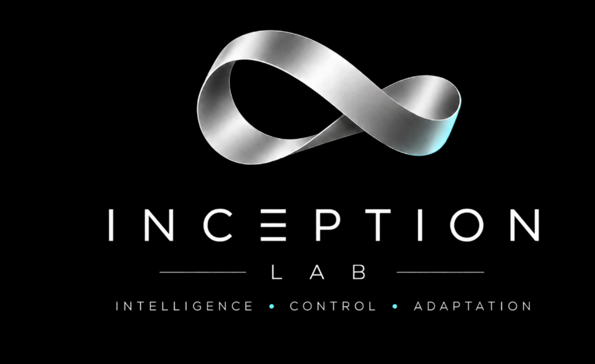

# FALCON (Feedback-Based Autonomy, Learning, and Control) Lab

University of California, San Diego
--

  

---

## Official GitHub for the FALCON Laboratory at the University of California, San Diego.

## Research Focus

- **Nonlinear and Hybrid Control**
- **Autonomous Systems**
- **Optimization**

---

## Lab Info

- **Lab Website:** [[(https://poveda.ucsd.edu/research-lab)](https://poveda.ucsd.edu/research-lab)]
- **Contact:** [jipoveda@ucsd.edu]

---

## Publications

Publications are available at our [publications page](https://poveda.ucsd.edu/publications).
